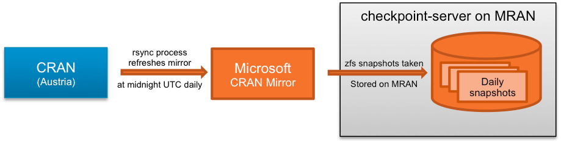

```{r setup, include=FALSE}
options(htmltools.dir.version = FALSE)
library(magrittr)
```

.center[

]


---

# Reproducibility

.pull-left[

]

.pull-right[

]


---

# Ambition for reproducible analysis

.center[

]

.footnote[Credit: <https://github.com/mikecroucher/juliacon2018/tree/gh-pages>]


---

# (Often) the reality

.center[

]


---

# Problem: R's package management

```{r built_under_version_warning, eval=FALSE}
> library(dplyr)
```

> Warning message:
> package ‘dplyr’ was built under R version 4.0.5

--

Would like: 

```{r desired_library_with_version, eval=FALSE}
> library(dplyr, version = x.y.z)
```

.footnote[See also: Jeroen Ooms, "Possible Directions for Improving Dependency Versioning in R
", DOI: [10.32614/RJ-2013-01](http://dx.doi.org/10.32614/RJ-2013-019)]

--

Daily CRAN checks:

> https://cran.r-project.org/web/checks/check_results_dplyr.html


---

# My R installations

```{r installation_folder}
fs::dir_ls("/opt/R")
```


---

# Package folders

```{bash package_folders_size, cache=TRUE}
du -sh /home/robert/R/x86_64-pc-linux-gnu-library/*
```


---

# Tip #1: Setup package folder

Open `~/.Renviron`:

```{r usethis_edit_r_environ, eval=FALSE}
usethis::edit_r_environ()
```

Set `R_LIBS_USER`: 

```{r}
readLines("~/.Renviron")
```

.footnote[More info about "specifiers": `?R_LIBS_USER`]


---

# CRAN timeline

```{r cran_timeline, echo=FALSE, fig.width=5, fig.height=2, fig.retina=3, out.height="30%", out.width="100%"}
tibble::tribble(
    ~event, ~start,
    "4.0.0", "2020-02-29",
    "4.0.1", "2020-06-06",
    "4.0.2", "2020-06-22",
    "4.0.3", "2020-10-10",
    "4.0.4", "2021-02-15",
    "4.0.5", "2021-03-31",
    "4.1.0", "2021-05-18"
) %>% 
    dplyr::mutate(
        start = as.Date(start),
        end = dplyr::lead(start),
        # end = tidyr::replace_na(end, lubridate::today())
    ) %>% 
  dplyr::slice(n = -nrow(.)) %>% 
  vistime::gg_vistime() + 
  ggplot2::theme(text = ggplot2::element_text(size = 16, family = "xkcd"))
```


---

# MRAN



.footnote[Credit: <https://mran.microsoft.com/documents/rro/reproducibility>]


---

# Set MRAN date

```{r repos_option}
getOption("repos")
```

Choose date:

| R version | Released   | MRAN       |
| --------- | ---------- | ---------- |
| R 4.0.0   | 2020-02-29 | 2020-06-06 |
| R 4.0.1   | 2020-06-06 | 2020-06-22 |
| R 4.0.2   | 2020-06-22 | 2020-10-10 |
| R 4.0.3   | 2020-10-10 | 2021-02-15 |
| R 4.0.4   | 2021-02-15 | 2021-03-31 |
| R 4.0.5   | 2021-03-31 |            |


---

# Tip #2: Set MRAN date *globally*

In

```{r}
fs::path(Sys.getenv("R_HOME"), "etc", "Rprofile.site")
```

include

```{r rprofile_options}
options(
  repos = c("MRAN" = "https://mran.microsoft.com/snapshot/2021-03-31")
)
```

.footnote[See also: <https://rstats.wtf/r-startup.html>]


---

# Tip #3: {here}

```{r setwd, eval=FALSE}
setwd("/path/that/only/exists/on/my/computer")
```

--

```{r here}
here::here()
```

```{r here_subfolder}
here::here("images")
```

.footnote[See also <https://www.tidyverse.org/blog/2017/12/workflow-vs-script>]


---

# Tip #4: {targets}

`Makefile`s for R

.center[
```{r GNU_make, echo=FALSE, out.width="50%"}
knitr::include_graphics("images/gnu_make.png")
```
]

--

Good intro:

```{r miles_mcbain, eval=FALSE}
gsub(
  pattern = "drake",
  replacement = "targets",
  "https://milesmcbain.xyz/posts/the-drake-post"
)
```


---


---

# Keyboard shortcuts

Tools > Modify Keyboard Shortcuts


---

# Tip #5: RStudio setup

.pull-left[
Windows:


]

.pull-right[
Linux


]


---

# RStudio config

Windows (hidden folder):

```
C:/Users/<user>/AppData/Roaming/RStudio/rstudio-prefs.json
```

Ubuntu:

```
/home/<user>/.config/rstudio/rstudio-prefs.json
```

.footnote[
My setup: <https://github.com/robertdj/dotfiles>
]


---

# Tip #6: Git + 🔥


---

# Tip #7: {renv}

- **r**eproducible **env**ironments
- Project package isolation

.footnote[
<https://rstudio.github.io/renv>
]

--

Regular package paths:

```{r libPaths}
.libPaths()
```


---

# {renv} package path

Project with {renv}:

```{r create_renv_project}
renv_folder <- fs::path_temp("renv_demo")
fs::dir_create(renv_folder)
callr::r(function() renv::init(restart = FALSE), wd = renv_folder)
```

--

```{r list_renv_files}
fs::dir_ls(path = renv_folder, all = TRUE)
```

--

```{r renv_libpaths}
out <- processx::run("Rscript", c("-e", ".libPaths()"), wd = renv_folder)
cat(out$stdout)
```


---

.center[

]


---


---

# R in Docker

.center[
```{r Rocker, echo=FALSE}

```
]

Rocker project:

- <https://github.com/rocker-org>

- <https://github.com/rocker-org/rocker-versioned2>


See also

- <https://github.com/robertdj/r-dockerfiles>

- <https://github.com/robertdj/renv-docker>

- <https://github.com/robertdj/pkg.deps>


---

.center[

]

